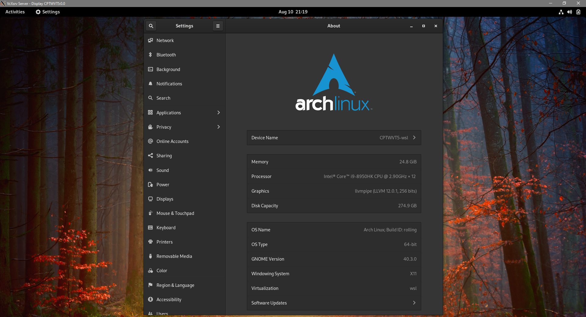

# Arch Linux rolling WSL2 Instance

A pre-configured `GNOME` desktop environment (DE) incorporating `VcXsrv Windows X Server` and `PulseAudio` passthrough.

## Installation

Ensure that you have `WSL2`, `VcXsrv Windows X Server`, and `7-Zip` installed before you continue with the steps below:

1. Open the `GitHub` [releases](https://github.com/milesbuckton/wsl2-arch/releases) tab and download all the `arch.tar.gz` files from the `vrolling` release assets.
2. Copy the `arch.tar.gz` files to the `sources` folder.
3. Run `extract.bat` to extract the distribution.
4. Run `import.bat` to import the distribution.
5. Run `upgrade.bat` to upgrade the WSL2 Linux kernel from `5.4` to `5.10`.
6. Run `boot.bat` to start `Arch Linux rolling` with `PulseAudio`.

To terminate the Linux instance simply log out of `GNOME`, and type `exit` in the terminal.

## Notes

Default user details are: `user:arch` `root:arch`

## Troubleshooting

If you're having issues getting the distribution to display, ensure that all the required services have `Public` and `Private` network access.
